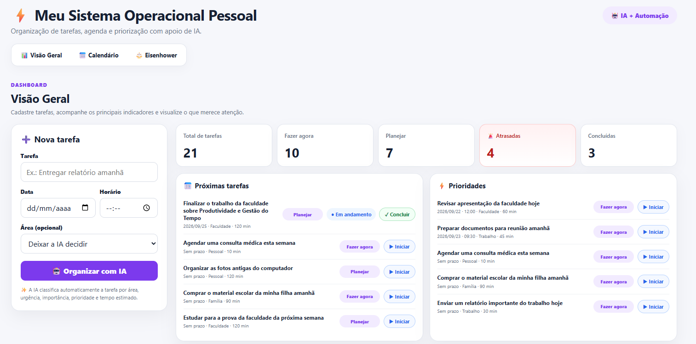
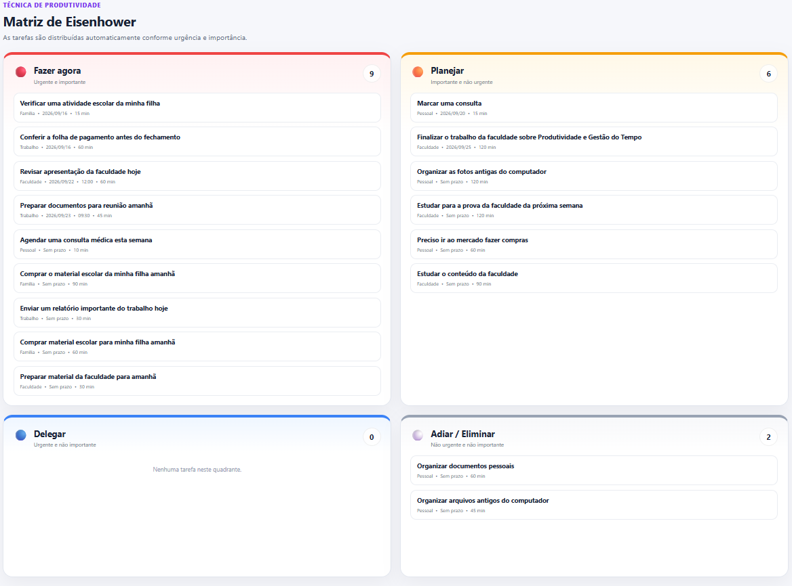
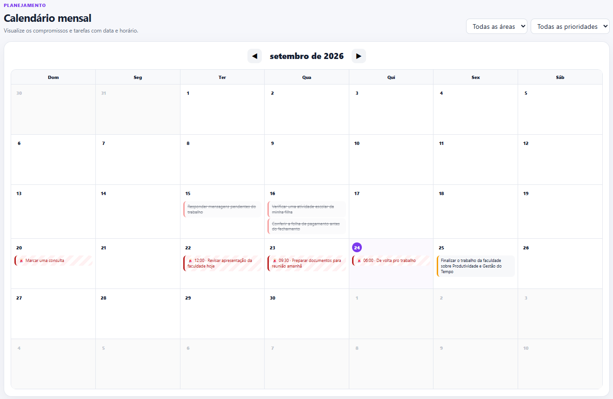
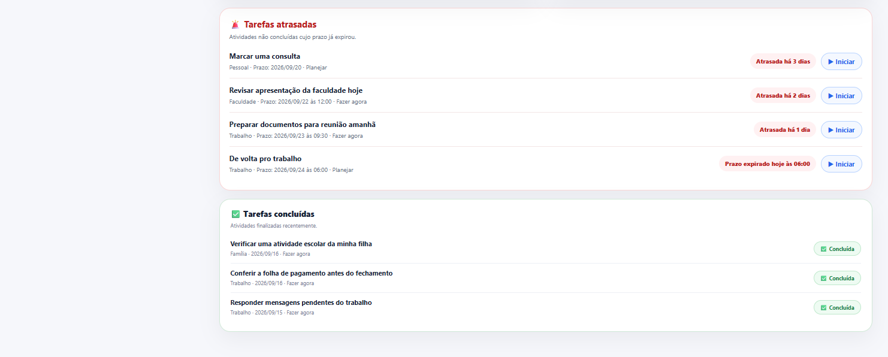
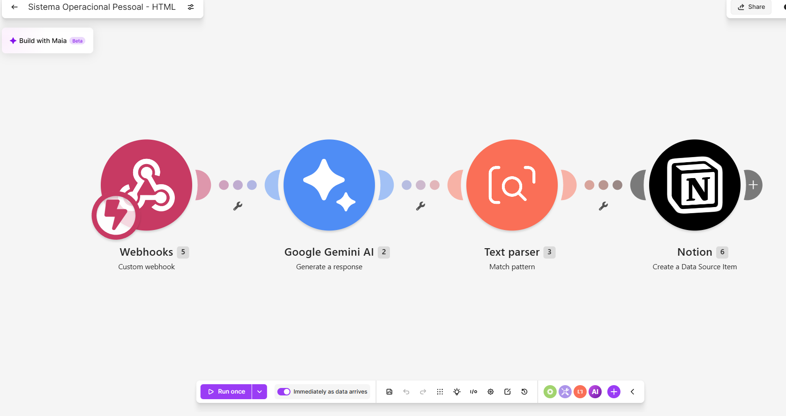
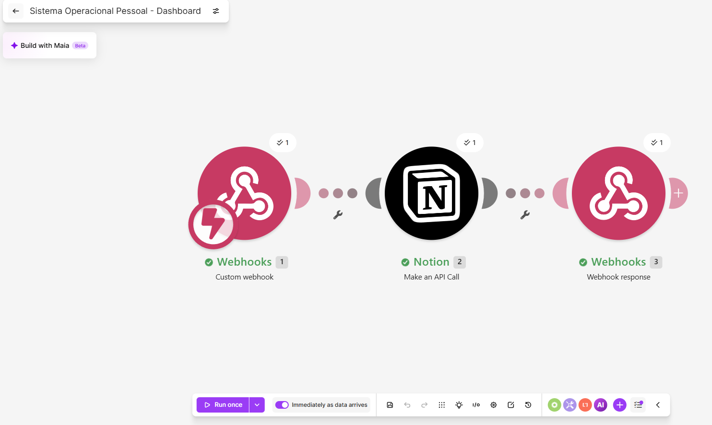
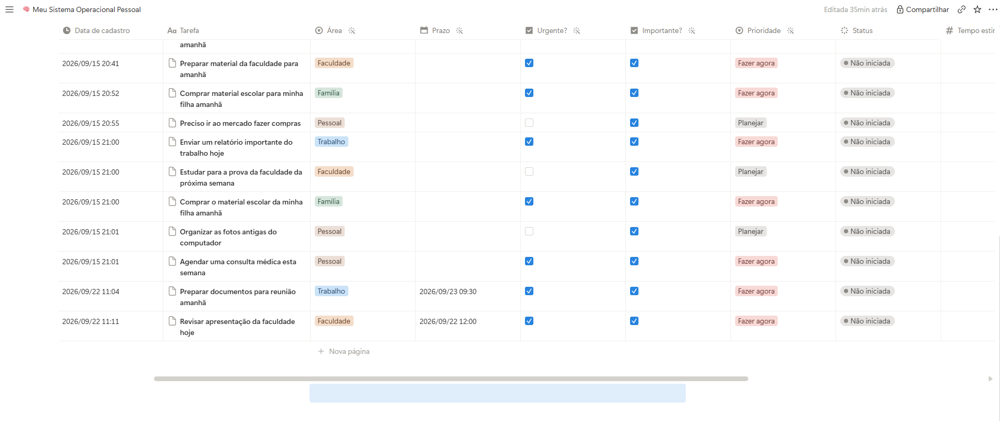

# ⚡ Meu Sistema Operacional Pessoal

Projeto desenvolvido para a disciplina **Produtividade e Gestão do Tempo**.

O sistema foi criado com o objetivo de centralizar tarefas, compromissos e prioridades em um único ambiente, utilizando **automação e Inteligência Artificial** como apoio à organização pessoal e à gestão do tempo.

---

## 👩‍💻 Identificação

**Aluna:** Eugenia Kazue Takara Stefens  
**RA:** 237219  
**Curso:** Graduação Tecnológica em Inteligência Artificial e Automação Digital  
**Disciplina:** Produtividade e Gestão do Tempo

---

## 🎯 Objetivo do projeto

O **Meu Sistema Operacional Pessoal** foi desenvolvido para facilitar a organização de uma rotina que envolve diferentes áreas, como:

- 💼 Trabalho
- 🎓 Faculdade
- 🏠 Pessoal
- 👨‍👩‍👧 Família

A proposta é reduzir o tempo gasto organizando tarefas manualmente e facilitar a identificação do que precisa ser feito primeiro.

Para isso, o sistema reúne **dashboard, calendário, Matriz de Eisenhower, automação e Inteligência Artificial** em uma única solução.

---

## 🖥️ Visão Geral do Sistema

O dashboard foi desenvolvido em **HTML, CSS e JavaScript** e funciona como a interface principal do sistema.

Por meio dele é possível:

- cadastrar novas tarefas;
- informar data e horário;
- informar uma área ou deixar a IA decidir;
- visualizar o total de tarefas;
- acompanhar tarefas prioritárias;
- iniciar tarefas e alterar o status para **Em andamento**;
- concluir tarefas diretamente pelo dashboard;
- visualizar tarefas concluídas em uma seção específica;
- identificar automaticamente tarefas não concluídas com prazo expirado;
- consultar as próximas atividades;
- acompanhar o planejamento pelo calendário;
- visualizar a Matriz de Eisenhower.

### Dashboard principal



A visão geral reúne cadastro, indicadores, próximas tarefas, prioridades e controles de status (Iniciar, Em andamento e Concluir).

---

## 🧠 Técnica de produtividade utilizada

A principal técnica utilizada no projeto é a **Matriz de Eisenhower**.

Ela organiza as atividades considerando dois critérios: **urgência** e **importância**.

As tarefas são classificadas em quatro grupos:

- 🔴 **Fazer agora** — urgente e importante;
- 🟠 **Planejar** — importante e não urgente;
- 🔵 **Delegar** — urgente e não importante;
- ⚪ **Adiar/Eliminar** — não urgente e não importante.

No sistema, essa classificação é realizada com apoio da Inteligência Artificial e apresentada visualmente em uma área específica do dashboard.

### Matriz de Eisenhower



---

## 📅 Planejamento e organização

O sistema possui um calendário mensal que permite visualizar as tarefas de acordo com suas datas e horários.

Também é possível utilizar filtros por **área** e **prioridade**, facilitando a visualização das atividades de acordo com o contexto desejado.

### Calendário mensal



---

## 🚨 Monitoramento de tarefas atrasadas

O sistema também realiza o monitoramento automático das tarefas que possuem prazo definido.

Por meio de uma lógica implementada em **JavaScript**, o dashboard compara a data e o horário da tarefa com a data e o horário atuais. Quando uma tarefa ainda não foi concluída e seu prazo já expirou, ela é automaticamente identificada como **atrasada**.

O dashboard apresenta:

- quantidade total de tarefas atrasadas;
- seção específica com as atividades vencidas;
- identificação de há quantos dias a tarefa está atrasada;
- indicação quando o prazo expirou no próprio dia;
- destaque visual das atividades vencidas no dashboard e no calendário.

Essa funcionalidade utiliza **lógica de programação**, sem necessidade de Inteligência Artificial, pois a identificação do atraso depende de uma comparação objetiva entre **prazo** e **status**. Dessa forma, a IA é utilizada apenas nas etapas em que sua capacidade de análise agrega valor ao sistema.

### Tarefas atrasadas



O acompanhamento separa visualmente tarefas atrasadas e tarefas concluídas; ao concluir uma atividade, ela deixa de ser considerada atrasada.

---

## 🤖 Utilização da Inteligência Artificial

A Inteligência Artificial é utilizada como apoio à organização e à tomada de decisão.

Ao cadastrar uma tarefa, o sistema envia as informações para o **Google Gemini**, que analisa a atividade e retorna:

- área;
- urgência;
- importância;
- prioridade;
- tempo estimado.

A prioridade é definida de acordo com a lógica da Matriz de Eisenhower.

Dessa forma, o usuário não precisa classificar manualmente cada nova atividade.

---

## 🔄 Automação do cadastro

O processo de cadastro funciona da seguinte forma:

```text
Usuário
   ↓
Dashboard HTML
   ↓
Webhook do Make
   ↓
Google Gemini
   ↓
Text Parser
   ↓
Notion
```

O **Make** funciona como responsável pela automação e integração entre a interface, a Inteligência Artificial e a base de dados.

### Cenário de cadastro no Make



---

## 🔄 Integração do Dashboard

Além do cadastro, foi criada uma segunda integração para que o dashboard possa consultar as tarefas armazenadas no Notion.

O fluxo funciona da seguinte forma:

```text
Dashboard HTML
   ↓
Webhook do Make
   ↓
Notion API
   ↓
Webhook Response
   ↓
Dashboard atualizado
```

Assim, as tarefas armazenadas na base podem ser utilizadas pelo próprio dashboard para alimentar o calendário, os indicadores, as listas e a Matriz de Eisenhower. O dashboard também permite acompanhar o andamento das atividades por meio dos botões **Iniciar** e **Concluir**, mantendo o status sincronizado com a base de tarefas.

### Cenário de integração do Dashboard



---

## 🗃️ Base de dados

O **Notion** é utilizado como base de dados para armazenar e gerenciar as tarefas.

Cada tarefa pode possuir as seguintes informações:

| Campo            | Função                                  |
| ---------------- | --------------------------------------- |
| Tarefa           | Descrição da atividade                  |
| Área             | Trabalho, Faculdade, Pessoal ou Família |
| Prazo            | Data e horário                          |
| Urgente?         | Identifica se a tarefa é urgente        |
| Importante?      | Identifica se a tarefa é importante     |
| Prioridade       | Classificação pela Matriz de Eisenhower |
| Status           | Situação atual da tarefa                |
| Tempo estimado   | Estimativa de duração                   |
| Data de cadastro | Registro da criação da tarefa           |

### Base de tarefas no Notion



---

## 🛠️ Tecnologias utilizadas

| Tecnologia        | Utilização                               |
| ----------------- | ---------------------------------------- |
| **HTML**          | Estrutura da interface                   |
| **CSS**           | Design e organização visual              |
| **JavaScript**    | Funcionamento dinâmico do dashboard      |
| **Make**          | Automação e integração                   |
| **Google Gemini** | Análise e classificação das tarefas      |
| **Notion**        | Armazenamento e gerenciamento dos dados  |
| **GitHub**        | Versionamento e armazenamento do projeto |
| **GitHub Pages**  | Publicação da interface web              |

---

## 🔁 Fluxo completo da solução

O sistema possui fluxos integrados para cadastro, visualização e acompanhamento do status das tarefas.

### 1. Cadastro inteligente

```text
Nova tarefa
    ↓
HTML / JavaScript
    ↓
Make
    ↓
Google Gemini
    ↓
Classificação com IA
    ↓
Notion
```

### 2. Visualização

```text
Notion
    ↓
Make
    ↓
Webhook Response
    ↓
HTML / JavaScript
    ↓
Dashboard
```

### 3. Acompanhamento de status

O usuário pode controlar a execução das tarefas diretamente no dashboard:

- **Iniciar** — altera a tarefa para **Em andamento**;
- **Concluir** — altera a tarefa para **Concluída**;
- tarefas concluídas deixam de ser tratadas como pendentes ou atrasadas;
- atividades finalizadas são apresentadas em uma seção própria de **Tarefas concluídas**.

Dessa forma, o dashboard funciona não apenas como painel de consulta, mas também como interface de acompanhamento da execução das atividades.

Essa arquitetura permite separar a **interface visual**, a **automação**, a **Inteligência Artificial** e a **base de dados**.

---

## 🔗 Links do projeto

- **Dashboard publicado (GitHub Pages):** https://takarakazue.github.io/produtividade-gestao-tempo/
- **Código-fonte e documentação (GitHub):** https://github.com/takarakazue/produtividade-gestao-tempo
- **Make — cenário do Dashboard:** https://eu1.make.com/public/shared-scenario/rzMGqzSNITR/sistema-operacional-pessoal-dashboard
- **Make — cenário de Cadastro:** https://eu1.make.com/public/shared-scenario/uYu9e34v4SG/sistema-operacional-pessoal-html
- **Notion — base do Sistema Operacional Pessoal:** https://app.notion.com/p/Meu-Sistema-Operacional-Pessoal-3dcf24962a4c8056bc42fb9162f70623?source=copy_link
- **Vídeo Pitch:** https://drive.google.com/file/d/1HzbP59nLn9wDPtGBkJInTyPbzTSCy_fY/view?usp=sharing

Os links acima permitem acessar a interface publicada, o código-fonte, os cenários compartilhados do Make, a base do Notion e o vídeo de apresentação do projeto.

---

## 🚀 Como utilizar

1. Acesse o dashboard.
2. Digite a tarefa no campo **Nova tarefa**.
3. Informe a data e o horário, caso necessário.
4. Se desejar, selecione a área da tarefa.
5. Caso não escolha uma área, deixe a opção **Deixar a IA decidir**.
6. Clique em **Organizar com IA**.
7. A tarefa será enviada ao Make.
8. O Gemini analisará e classificará a tarefa.
9. O Make registrará as informações no Notion.
10. O dashboard consulta os dados armazenados e apresenta as tarefas nas áreas correspondentes.
11. Para começar uma atividade, clique em **Iniciar**; o status passa para **Em andamento**.
12. Ao finalizar, clique em **Concluir**; a tarefa passa para **Concluída** e é exibida na seção de tarefas concluídas.

---

## ✨ Funcionalidades

O sistema desenvolvido possui:

- cadastro de tarefas;
- classificação automática com IA;
- identificação de urgência e importância;
- Matriz de Eisenhower;
- estimativa de tempo;
- organização por áreas;
- planejamento por data e horário;
- calendário mensal;
- filtros por área e prioridade;
- indicadores de produtividade;
- lista de próximas tarefas;
- visualização de tarefas prioritárias;
- acompanhamento de status **Não iniciada → Em andamento → Concluída**;
- botões **Iniciar** e **Concluir** no dashboard;
- seção específica de tarefas concluídas;
- monitoramento automático de tarefas atrasadas;
- identificação de prazo expirado por data e horário;
- indicador com a quantidade de tarefas atrasadas;
- destaque visual das atividades vencidas;
- integração com base de dados;
- automação entre diferentes ferramentas.

---

## 📈 Ganhos esperados

A utilização do sistema busca proporcionar:

- maior centralização das informações;
- redução do tempo gasto organizando tarefas;
- melhor visualização das prioridades;
- redução de esquecimentos;
- apoio ao planejamento da rotina por datas, horários e calendário mensal;
- redução de retrabalho;
- maior clareza sobre tarefas urgentes e importantes;
- melhor equilíbrio entre trabalho, faculdade, vida pessoal e família.

A Inteligência Artificial atua como **apoio à organização**, enquanto a decisão final e o acompanhamento das atividades permanecem sob responsabilidade do usuário.

---

## 📁 Estrutura do projeto

```text
Meu-Sistema-Operacional-Pessoal/
│
├── index.html
├── style.css
├── script.js
├── README.md
│
└── images/
    ├── dashboard-geral-parte-superior.png
    ├── dashboard-geral-acompanhamentos.png
    ├── calendario.png
    ├── eisenhower.png
    ├── make-cadastro.png
    ├── make-dashboard.png
    └── notion-base.png
```

---

## 🎓 Considerações finais

O projeto demonstra como diferentes ferramentas digitais podem ser integradas para criar um sistema pessoal de produtividade.

A combinação entre **dashboard web, Matriz de Eisenhower, calendário, automação, Inteligência Artificial e armazenamento de dados** permite transformar o gerenciamento de tarefas em um processo mais visual, centralizado e automatizado. O acompanhamento por status permite ainda visualizar a evolução das atividades desde o início até a conclusão.

Mais do que simplesmente registrar tarefas, a solução utiliza IA para auxiliar na organização das prioridades e no planejamento do tempo.

---

## 👩‍💻 Autora

**Eugenia Kazue Takara Stefens**  
**RA: 237219**  
**Graduação Tecnológica em Inteligência Artificial e Automação Digital**
